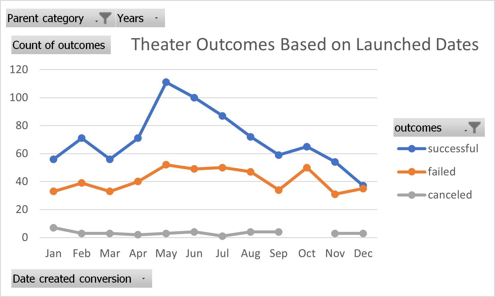
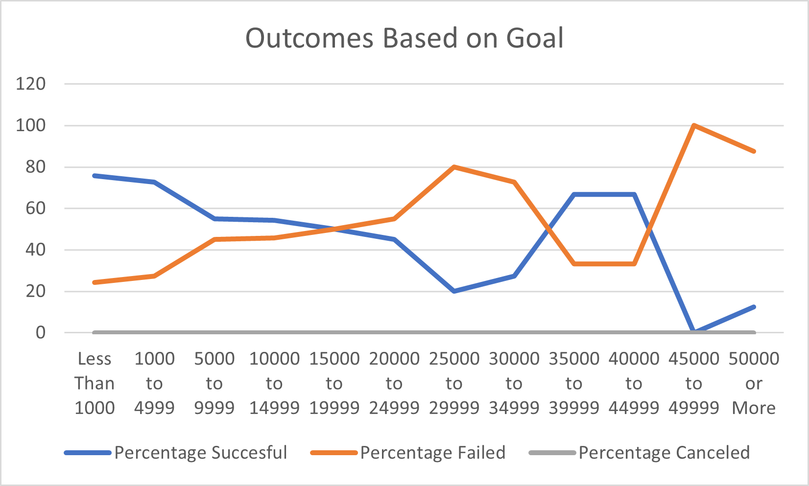

# Kickstarting with Excel

## Overview of Project

### The purpose for this project is to analyze and to uncover any hidden trends by making it more readable and searchable, by creating tables, charts and graphs.

## Analysis and Challenges

### Analysis of Outcomes Based on Launch Date

### Analysis of Outcomes Based on Goals

### Challenges and Difficulties Encountered

#### Main challenge for me was using the excel formulas vlookup and countifs, but the documentation help me understand it better. Also I have a habit to prove if the result given is true or not, so playing a little bit with the formulas and see what they do helped too.

## Results

- The month of May has the most successful events, and June is in second place. However, May and June has the most events.

- December has the least amount of successful events, but it also has the least amount of total events.

- The number of failed events per month don't vary much throughout the year.

- Events are rarely canceled throughout the year, with only January been slightly higher, and no canceled events on October.

- December is the least preforming month of the year, it has almost the same amount of successful events and failed events.

- Events with a goal of 1000 or less have the most successful events.

- Events with a goal of 45000 to 49999 have 0 successful events.

## What are two conclusions you can draw about the Outcomes based on Launch Date?

- The months of May and June are the best months to start a campaign. They have the most number of successful events and a greater ratio of successful to failed events, about 2:1.

- December is the worst month to start a campaign, almost half of all events in December fail.

## What can you conclude about the Outcomes based on Goals?

- Events with very high goals tend to fail.

- Events with low goals are more likely to succeed.

- Overall the chart suggests that the lower the goal the more likely it is to succeed, and the higher the goal the less likely it is to succeed, with the exception of events with goals of 35000 to 39999 and 40000 to 44999, these two perform significantly better.

## What are some limitations of this dataset?

- There is no data to account for states, districts or regions within a country. There is no way to know if our samples are from every state or just a few.

- These results don't take into account the end of the campaign, some events last for more than one month and we don't know if this can skew the results.

## What are some other possible tables and/or graphs that we could create?

- We can find out if the overlapping of multiple events happening at the same time has any influence over each other or not.

- We could compare how same categories compare on different countries.
